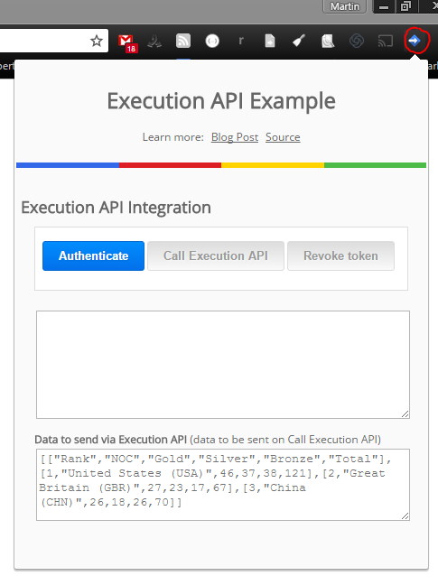

# Using the Google Apps Script Execution API in Chrome Extensions
This is a sample Google Chrome extension that demonstrates using the Chrome Identity API to authorize access to use the Google Apps Script Execution API. If you are not familiar with these services here:

* [Getting started with Chrome Extensions](https://developer.chrome.com/extensions/getstarted)
* [The Chrome Identity API](https://developer.chrome.com/apps/app_identity)
* [Google Apps Script Execution API](https://developers.google.com/apps-script/guides/rest/)

## Chrome Extensions and Content Security
> Extensions allow you to add functionality to Chrome without diving deeply into native code. You can create new extensions for Chrome with those core technologies that you're already familiar with from web development: HTML, CSS, and JavaScript.

If you have developed applications using the Execution API with HTML/JavaScript you've probably used Google client library to do this. As Google states *"while not strictly necessary, can greatly assist in handling OAuth for the application"*. In the case of Chrome Extensions the use of client libraries can be problematic. For example, when developing my first Chrome Extension I encountered a number of errors similar to:

>`Refused to load the script 'https://apis.google.com/js/client.js' because it violates the following Content Security Policy directive: "script-src 'self' chrome-extension-resource:"`

There are solutions for these on Stack Overflow ([like this one](http://stackoverflow.com/questions/18681803/loading-google-api-javascript-client-library-into-chrome-extension)), but I struggled to get those to work. As the Execution API relies on the user having a Google Account using the Chrome Identity API appears to be a better solution.

##Testing it out

The quick and easy to get the code running on your computer.

1. Download the source code.
1. [Load the extension](https://developer.chrome.com/extensions/getstarted#unpacked) in developer mode.
1. Open the Execution API Example popup 
1. Authenticate extension and the Call Execution API

##How it works
When the popup is opened the extension silently checks/requests a authentication token. If a token is present the authenticate button is disabled, otherwise the button is enabled and when clicked starts the interactive authentication flow. 

##Notes on setting up
For notes on setup and usage [read this blog post](https://mashe.hawksey.info/?p=17506)

##Acknowledgements
This project is based on:

* [Identity example in Chrome Apps Samples](https://github.com/GoogleChrome/chrome-app-samples/tree/master/samples/identity)
* [GDE Sample: Chrome extension Google APIs by Abraham's](https://github.com/GoogleDeveloperExperts/chrome-extension-google-apis) 